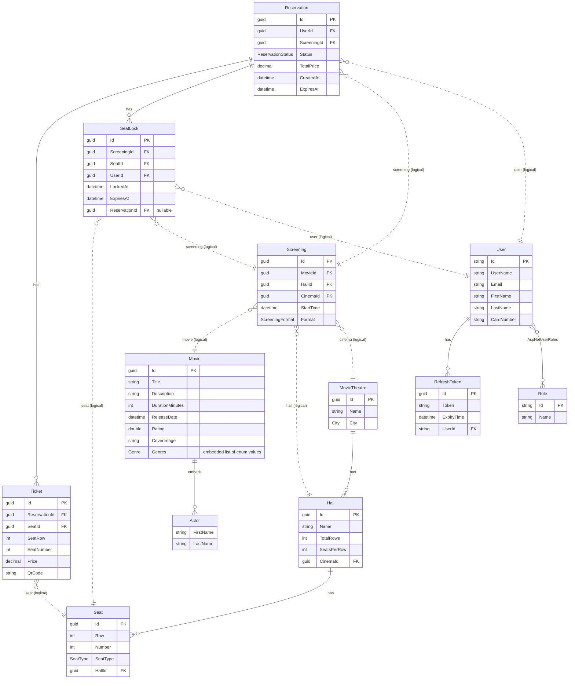

# Database schema

CineMATF is built as database-per-service: each microservice owns its own schema and
never reads another service's tables directly. Cross-service references (e.g. a
`Screening` pointing at a `Movie`) are plain `Guid` values resolved over HTTP/gRPC at
runtime, not enforced foreign keys. That's the correct microservices pattern - this
doc exists purely to give a single, browsable view of the schema; it does **not**
imply the databases should be merged.

This is a hand-maintained snapshot. If you add/change an entity or a migration, update
this file in the same PR - it will drift otherwise.

## Services and storage

| Service          | Engine   | Database name (see `docker-compose.yml`) | Owns                              |
|------------------|----------|--------------------------------------------|------------------------------------|
| Cinema.API       | Postgres | `cinemadb`                                 | Theatres, Halls, Seats             |
| Movie.API        | MongoDB  | `MovieDB` (collection `Movies`)             | Movies (with embedded Actors)      |
| Screening.API    | Postgres | `ScreeningDB`                              | Screenings                         |
| Reservation.API  | Postgres | `ReservationServiceDb`                     | Reservations, Tickets, SeatLocks   |
| Identity.API     | Postgres | `IdentityDB`                               | Users, Roles, RefreshTokens        |

All four Postgres databases share one `postgres:16` container (see
`docker/postgres/init-databases.sql`), but that's just deployment convenience - each
service's `DbContext`/migrations are still fully independent, and one service could be
pointed at its own instance without any code changes.

## Entity-relationship diagram

Solid lines (`──`) are real foreign keys enforced inside a single service's database.
Dashed lines (`┄┄`) are logical references only - a `Guid` copied across a service
boundary, validated (if at all) by calling the owning service's API, not by a DB
constraint.

## Notes

- `MovieTheatre`, `Hall`, `Seat` correspond to the `Cinema.API.Entities` classes of the
  same name (the `MovieTheatre` class lives in `Services/Cinema.API/Entities/Cinema.cs`).
- `User` and `Role` are ASP.NET Core Identity's `IdentityUser`/`IdentityRole`, so the
  real tables are `AspNetUsers`/`AspNetRoles`/`AspNetUserRoles`/etc. Only the
  CineMATF-specific additions (`FirstName`, `LastName`, `CardNumber`, `RefreshTokens`)
  are hand-written; the rest is framework-managed and omitted here for brevity.
- `Movie.Genres` and `Cinema.Seat.SeatType`/`MovieTheatre.City` are enums serialized as
  strings/ints depending on the store (Mongo stores the enum inline; Postgres columns
  use `HasConversion<string>()` for `City`, plain `int` for `SeatType`).
- Seed data for local/dev runs lives next to each service:
  `Cinema.API/Services/DataSeeder.cs`, `Movie.API/Data/MovieContextSeed.cs`,
  `Screening.API/Services/DataSeeder.cs`, `Reservation.API/Services/DataSeeder.cs`,
  `Identity.API/Data/IdentityDataSeeder.cs`. The Guids are intentionally
  human-readable (`cccccccc-...-0001`, `ffffffff-...-0001`, etc.) so you can trace a
  seeded `Screening.MovieId` back to the `Movie.API` seed and so on.
